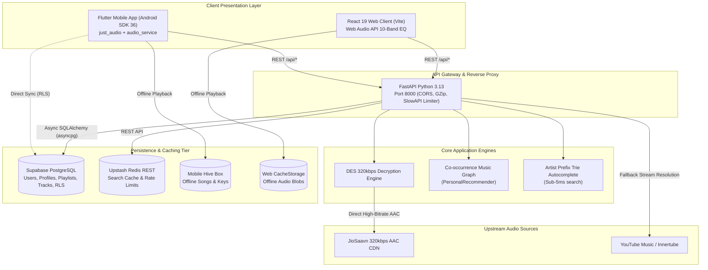
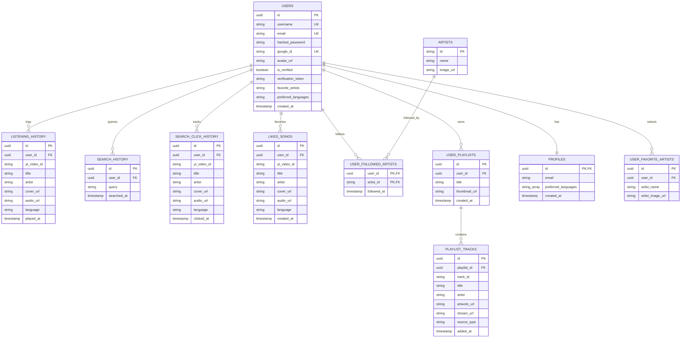
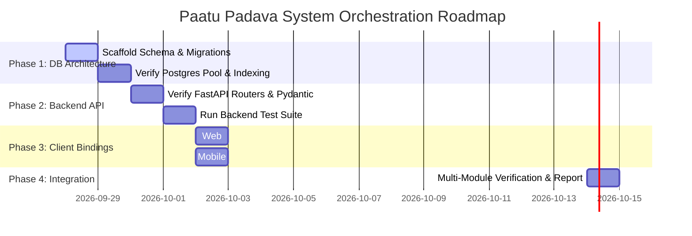

# 🎵 PAATU PADAVA (பாட்டு பாடவா) — Master Project Specification & Architecture Blueprint
**Version:** 2.0.0  
**Status:** Approved Architecture Blueprint  
**System Architect:** Lead Systems Architect & Autonomous Meta-Orchestrator  
**Target Environment:** Production Cross-Platform Music Ecosystem (Android + Web + Cloud Backend)

---

## 1. Executive Summary & Domain Scope

### 1.1 Application Domain
**Paatu Padava** is a production-grade, multi-platform music streaming and discovery ecosystem engineered specifically for high-fidelity Indian regional audio (Tamil, Telugu, Hindi, Malayalam, Kannada, Punjabi, etc.) and international catalogs. The platform combines dual-engine hybrid audio resolution (JioSaavn 320kbps direct CDN streaming + YouTube Music fallback), cloud synchronization with Supabase PostgreSQL, studio-grade equalizers, 100% offline playback, and real-time collaborative filtering recommendation graphs.

### 1.2 Core Business Capabilities
1. **Studio-Quality 320kbps Audio Resolution:** Direct DES-decrypted AAC media streaming from JioSaavn CDN with graceful fallback to YouTube audio streams.
2. **Dual-Tier State Persistence:**
   - **Cloud Tier:** Supabase PostgreSQL with Row Level Security (RLS) for user profiles, playlists, liked tracks, and favorite artists.
   - **Local Edge Tier:** Hive & PathProvider on mobile (offline downloaded tracks, audio cache), HTML5 CacheStorage & LocalStorage on web.
3. **Real-Time Graph Recommendations:** Co-occurrence music graph with session windowing (45 min), taste profile balancing, and regional language bias.
4. **Sub-5ms Autocomplete:** In-memory prefix Trie populated from curated regional discographies and database playback history.
5. **Battery & Wakelock Optimization:** Strict 5-minute inactivity guard tearing down background `AudioSession` and foreground services on mobile to prevent battery drain.
6. **Synchronized LRC Lyrics Engine:** Real-time synchronized lyrics rendering with millisecond-precision offset calibration.
7. **One-Click Spotify Import:** Direct mapping of Spotify playlist and album URLs to native 320kbps audio streams.

---

## 2. Workspace Directory Mapping & Tech Stack Matrix

```
Paatu_Paaduva/
├── .antigravity/                   # Multi-Agent Configuration & Autonomous Skills
│   ├── agents.json                 # Role & tool permission matrix for sub-agents
│   └── skills/
│       ├── db-guidelines/SKILL.md  # Database schema, migration, and connection rules
│       ├── backend-guidelines/SKILL.md # FastAPI route standards, Pydantic, security
│       └── mobile-guidelines/SKILL.md  # Clean Architecture, AudioService, battery guards
├── plans/                          # Architectural Blueprints & Execution Summaries
│   ├── PROJECT_SPEC.md             # Master specification, ERD, and API contracts
│   └── SUMMARY.md                  # Milestone completion logs & agent verification
├── backend-data-hf/                # FastAPI Python 3.13 Backend Service (mapped to /backend)
│   ├── routers/                    # music, auth, history, playlists, users, utils
│   ├── services/                   # recommender, youtube, spotify, cache
│   ├── connection.py               # SQLAlchemy asyncpg engine + Upstash Redis
│   ├── models.py                   # Relational ORM models
│   └── tests/                      # Unit and integration test suites
├── mobile/                         # Native Flutter 3.x Android Application (mapped to /mobile)
│   ├── lib/domain/                 # Clean Architecture domain entities (TrackEntity)
│   ├── lib/data/                   # CatalogRepository, SongRepository
│   ├── lib/logic/                  # AudioQueueHandler, SmartShuffleController
│   ├── lib/services/               # SyncManager, SupabaseService, SearchService
│   └── lib/ui/                     # Material 3 UI screens, FullPlayer, Lyrics
├── frontend-react/                 # React 19 + TypeScript + Vite PWA (mapped to /frontend)
│   ├── src/components/             # Equalizer, PlayerBar, TrackList, Visualizer
│   ├── src/context/                # AudioContext, AuthContext, ThemeContext
│   ├── src/pages/                  # Home, Search, LikedSongs, PlaylistDetail, AlbumView
│   └── src/services/               # API clients, Web Audio 10-band DSP engine
├── mcp_server.py                   # Model Context Protocol (MCP) AI Tool Provider
└── start_server.bat                # Automated multi-service development launcher
```

### 2.1 Technology Stack Matrix

| Layer | Technology | Version | Rationale & Key Responsibilities |
|---|---|---|---|
| **Database (Cloud)** | **Supabase PostgreSQL** | v15+ (Cloud) | Multi-tenant persistent user data, playlist tracks, favorite artists, RLS policies. |
| **Database (Cache/KV)** | **Upstash Redis** | REST / v5.x | High-speed cache, API rate limiting via SlowAPI, token revocation. |
| **Database (Mobile Local)** | **Hive + PathProvider** | v2.2.3 | Instant zero-latency offline downloaded song storage and cached metadata. |
| **Database (Web Local)** | **HTML5 CacheStorage** | DOM API | Offline audio blob caching and storage quota monitoring. |
| **ORM / Data Access** | **SQLAlchemy + asyncpg** | v2.0.23+ | Fully asynchronous relational queries, connection pooling, pre-ping validation. |
| **Backend API Framework**| **FastAPI** | v0.104.1+ (Python 3.13) | Asynchronous REST endpoints, Pydantic v2 schemas, CORS, GZip compression. |
| **Mobile Client** | **Flutter / Dart** | Flutter 3.22+ (Dart 3) | Native Android SDK 36, Clean Architecture, `just_audio`, background `audio_service`. |
| **Web Client** | **React 19 + Vite + TS** | React 19.2, Vite 8 | High-performance PWA, Web Audio API 10-band parametric equalizer, Lucide icons. |
| **AI MCP Interface** | **Model Context Protocol** | v2.2.0 | Exposes 5 specialized streaming and catalog tools to AI agent runtimes. |

---

## 3. Target System Architecture & Data Model (ERD)

### 3.1 High-Level Architecture Flow



### 3.2 Entity Relationship Diagram (ERD)



---

## 4. Core API Contracts & Interface Specifications

### 4.1 Base URL & Global Headers
- Base URL: `http://localhost:8000/api` (Local) / Production Proxy
- Standard Headers:
  - `Content-Type: application/json`
  - `Authorization: Bearer <jwt_access_token>` (for protected routes)

### 4.2 API Endpoint Directory

#### Category 1: Health & Diagnostics
| Method | Endpoint | Auth | Description |
|---|---|---|---|
| `GET` | `/health` | None | Service liveness and dependency status probe. |
| `GET` | `/search/autocomplete` | None | Instant prefix search over loaded artist trie (`?q=ani`). |

#### Category 2: Music Streaming & Catalog (`/api/music`)
| Method | Endpoint | Query / Body Params | Response Summary |
|---|---|---|---|
| `GET` | `/home` | `lang: str` (e.g. `tamil,telugu`) | Returns categorized sections (Trending, Regional Hits, Artists, New Releases). |
| `GET` | `/search` | `q: str`, `lang: str`, `filter: str` | Hybrid multi-source catalog search (Saavn 320k + YouTube) with language match ranking. |
| `GET` | `/search/suggestions` | `q: str` | Fast suggestion list based on Trie and trending queries. |
| `GET` | `/stream/{song_id}` | `source: str` (saavn / yt) | Resolves direct playable stream URL (decrypted 320kbps AAC or YouTube m4a). |
| `GET` | `/download` | `url: str`, `title: str`, `artist: str` | Proxies and decodes high-bitrate audio stream for offline device persistence. |
| `POST`| `/prefetch-stream` | `{ "song_id": str, "source": str }` | Warm-ups stream cache for zero-gap playback in queues. |
| `POST`| `/player-state` | `{ "song_id": str, "position_ms": int, "is_playing": bool }` | Saves cross-device playback state to Redis. |
| `GET` | `/player-state` | None | Retrieves latest active playback state for seamless device resumption. |
| `GET` | `/for-you` | `limit: int` (default 20) | Personalized recommendations from co-occurrence graph based on user taste history. |
| `POST`| `/shuffle-order` | `{ "track_ids": list[str], "current_id": str }` | Smart shuffle engine computing genre-balanced, anti-repeat nearest-neighbor order. |
| `GET` | `/recommendations/{song_id}` | `limit: int` (default 10) | Collaborative-filtering recommendations seeded by a specific song node. |
| `GET` | `/related/{song_id}` | None | Related songs and artists for contextual playback. |
| `GET` | `/lyrics/{song_id}` | `title: str`, `artist: str` | Synchronized lyrics (LRC timestamps) or plain lyrics fallback. |
| `GET` | `/lyrics/synced` | `track_name: str`, `artist_name: str` | Explicit synced lyrics lookup using `syncedlyrics`. |
| `POST`| `/like` | `{ "yt_video_id": str, "title": str, "artist": str, "cover_url": str, "audio_url": str, "language": str }` | Adds track to user's liked library. |
| `DELETE`| `/unlike/{song_id}`| `song_id: str` | Removes track from user's liked library. |
| `GET` | `/liked` | `skip: int`, `limit: int` | Returns paginated list of user's liked songs. |
| `GET` | `/artist/{artist_id}`| `artist_id: str` | Top tracks, albums, and bio for a specific artist. |
| `GET` | `/albums/{album_id}` | `album_id: str` | Full track listing and artwork for a release. |

#### Category 3: Authentication & Identity (`/api/auth`)
| Method | Endpoint | Payload / Params | Response Summary |
|---|---|---|---|
| `POST`| `/register` | `{ "username": str, "email": str, "password": str }` | Creates user account, hashes password via Argon2, sends verification email. |
| `POST`| `/login` | `{ "email": str, "password": str }` | Validates credentials, issues JWT access token. |
| `POST`| `/google` | `{ "id_token": str }` | Verifies Google OAuth token, creates or links account, returns JWT. |
| `GET` | `/me` | None (Bearer Token) | Returns current authenticated user record with preferences and stats. |
| `GET` | `/me/artists-details`| None | Detailed metadata for user's selected onboarding favorite artists. |
| `POST`| `/forgot-password` | `{ "email": str }` | Generates secure numeric OTP (6 digits) with 5-attempt limit and rate limiting. |
| `POST`| `/reset-password` | `{ "email": str, "otp": str, "new_password": str }` | Constant-time digest verification of OTP and Argon2 password update. |
| `PATCH`| `/preferences` | `{ "favorite_artists": list[str], "preferred_languages": list[str] }` | Updates onboarding music preferences and language weights. |
| `PATCH`| `/preferences/languages`| `{ "preferred_languages": list[str] }` | Quick update for audio language biasing. |
| `POST`| `/logout` | None | Revokes active token. |

#### Category 4: History & Search Analytics (`/api/history`)
| Method | Endpoint | Description |
|---|---|---|
| `POST`| `/listen` | Records playback event with song metadata into `listening_history` (triggers graph affinity updates). |
| `GET` | `/listen` | Retrieves paginated listening history for current user. |
| `DELETE`| `/song/{history_id}` | Deletes individual playback record from user history. |
| `DELETE`| `/date/{date_string}` | Deletes all records played on a specific date (`YYYY-MM-DD`). |
| `DELETE`| `/all` | Completely wipes user listening history. |
| `POST`| `/search` | Records search query (only upon keyboard `onSubmitted`, guarded from keystroke spam). |
| `GET` | `/search` | Retrieves distinct recent search terms (capped at 12 entries). |
| `POST`| `/search-click` | Records click-through event from search results for ranking feedback loop. |
| `GET` | `/recent-searches` | Returns recent searches with click metadata. |

#### Category 5: Playlists & External Importer (`/api/playlists`)
| Method | Endpoint | Description |
|---|---|---|
| `POST`| `/preview-spotify` | `{ "url": str }` — Parses Spotify playlist/album URL and returns track metadata preview. |
| `POST`| `/import-spotify` | `{ "url": str, "name": str }` — Resolves Spotify tracks to 320k catalog streams and creates playlist. |

---

## 5. UI Architecture & Navigation Flows

### 5.1 Mobile Application (Flutter Clean Architecture)
- **State Management:** Reactive `ValueNotifier` & `StreamBuilder` bound to `AudioService` and `SyncManager`.
- **Navigation Structure (`main_navigation.dart`):**
  - **Tabs:** `Home` (Trending & For You), `Search` (Fuzzy Trie & Catalog), `Library` (Playlists & Offline Downloads), `Settings` (Audio Quality & EQ).
  - **Overlays / Modal Screens:**
    * `FullPlayerScreen`: Hero album art, scrubber, 5-band EQ launcher, dynamic color extraction.
    * `LyricsScreen`: Auto-scrolling LRC lyrics with millisecond adjustment slider.
    * `OnboardingArtistsScreen`: Spotify-style dynamic artist bubble expanding related collaborators on tap.
    * `AlbumScreen` / `ArtistScreen`: Deep-linked catalog views.
- **Audio Lifecycle Guard:**
  ```dart
  // Paatu Padava 5-Minute Battery Guard
  if (playbackState == AudioPlaybackState.paused || idle) {
    _inactivityTimer = Timer(const Duration(minutes: 5), () {
      AudioSession.instance.setActive(false);
      stopForegroundService();
      closeIdleSockets();
    });
  }
  ```

### 5.2 Web Application (React 19 + Vite)
- **Layout Architecture:**
  - `Sidebar`: Navigation links (Home, Search, Liked Songs, Library, Settings), Playlist creation button, Offline status badge.
  - `TopBar`: Profile avatar, Auth controls, Language filter pills.
  - `Main Content Area`: Dynamic React Router routes with smooth page transitions.
  - `PlayerBar` (Persistent Bottom Dock): Track metadata, Play/Pause, Skip, Scrubber, Volume, Equalizer popover toggle, Lyrics sheet toggle.
- **Web Audio 10-Band Equalizer Chain:**
  ```
  HTML5 <audio> / MediaElementSource
        │
  BiquadFilterNode [32 Hz] (LowShelf)
        │
  BiquadFilterNode [64 Hz] (Peaking)
        │
  BiquadFilterNode [125 Hz, 250 Hz, 500 Hz, 1 kHz, 2 kHz, 4 kHz, 8 kHz] (Peaking)
        │
  BiquadFilterNode [16 kHz] (HighShelf)
        │
  AnalyserNode (FFT size 256 for Canvas Spectrum Visualizer)
        │
  AudioDestination (Speakers / Headphones)
  ```

---

## 6. Execution Roadmap & Autonomous Phase Plan



### Milestone Checklist:
- [x] **Phase 1 (Discovery):** System architecture audited, dependencies validated, `PROJECT_SPEC.md` compiled.
- [ ] **Phase 2 (Self-Provisioning):** Multi-agent directory `.antigravity/` with `agents.json` and 3 specialized skills created.
- [ ] **Phase 3 (DB Verification):** Database schema integrity, async connection pools, and migration scripts validated.
- [ ] **Phase 4 (Backend Tests):** Core server routes, auth security, and recommender engine tests passing 100%.
- [ ] **Phase 5 (Client Verification):** Web client typecheck passes (`tsc --noEmit`), mobile Flutter tests pass.
- [ ] **Phase 6 (Master Summary):** Deliverables and verification logs documented in `./plans/SUMMARY.md`.
